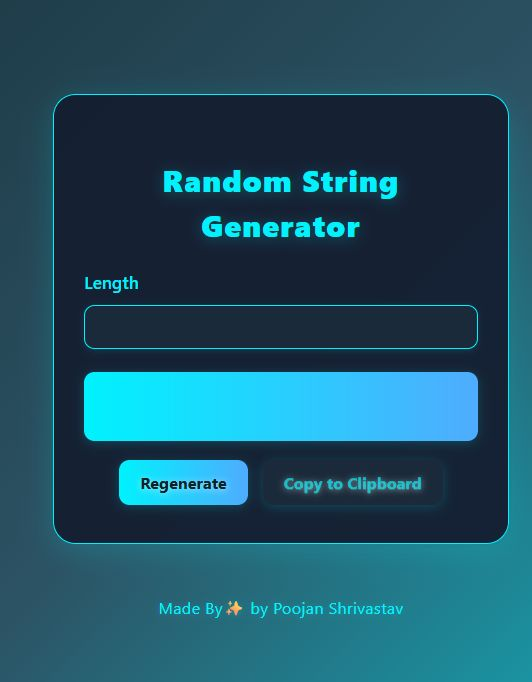
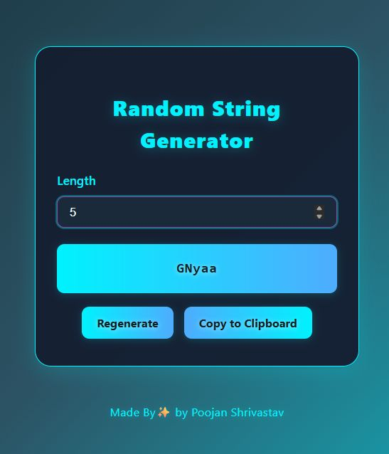

# 🔐 Random String Generator

A sleek, fully responsive React application that allows users to generate secure, random alphanumeric strings of custom lengths. Built using React Hooks and styled with a glowing, futuristic dark theme.



---

## 🚀 Features

- 🔁 Generate random strings instantly
- ✏️ Customizable length (1–50 characters)
- 🧠 Uses `useState`, `useEffect`, `useCallback` for smooth and optimized behavior
- 📋 Copy to clipboard functionality

---

## 🛠️ Tech Stack

- **React** (Vite + JSX)
- **Hooks**: `useState`, `useEffect`, `useCallback`
- **CSS**: Internal & inline (custom glowing theme)

---

## 📷 Preview

> 

---

---

## 📁 Folder Structure

```
/src
  ├── App.jsx
  ├── main.jsx
  └── index.css 
```

---

## ✨ Future Customization Ideas

- Add dark/light mode toggle
- Generate only numbers/alphabets/symbols via options
- Add password strength indicator
- Export to `.txt` or `.csv`

---

## 👨‍💻 Author

Made with ✨ by [Poojan Shrivastav](www.linkedin.com/in/poojanshrivastav21)

---
